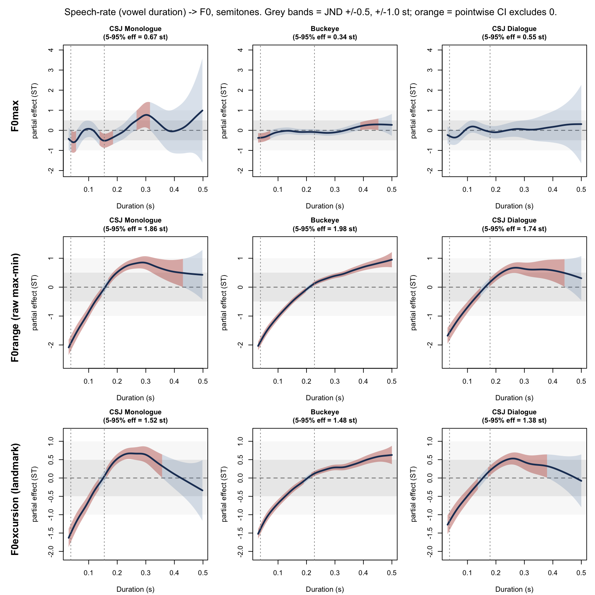
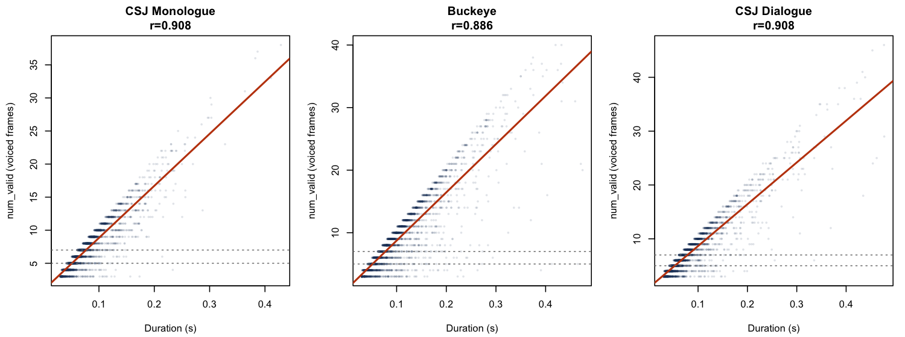
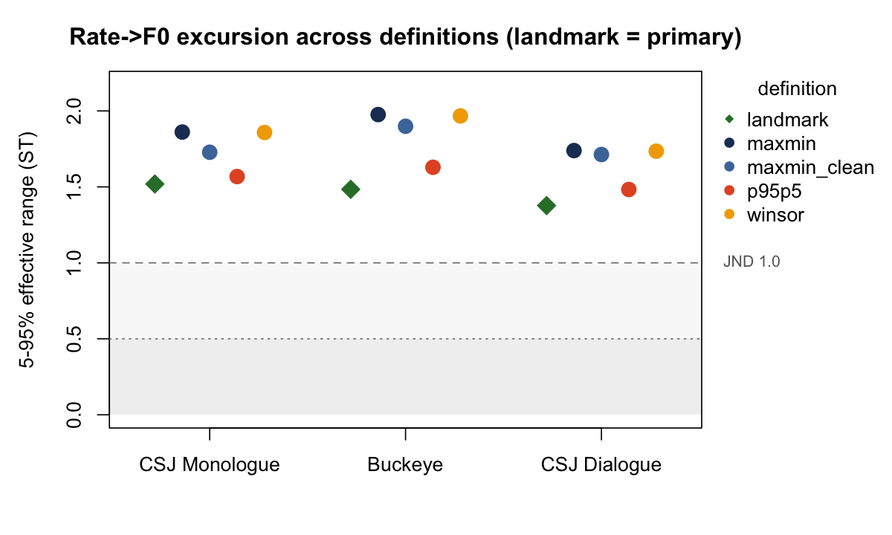
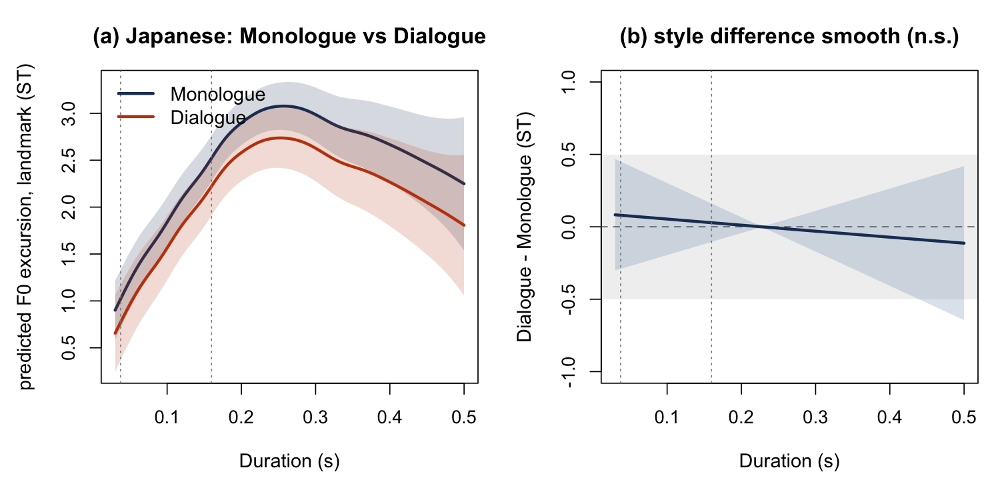
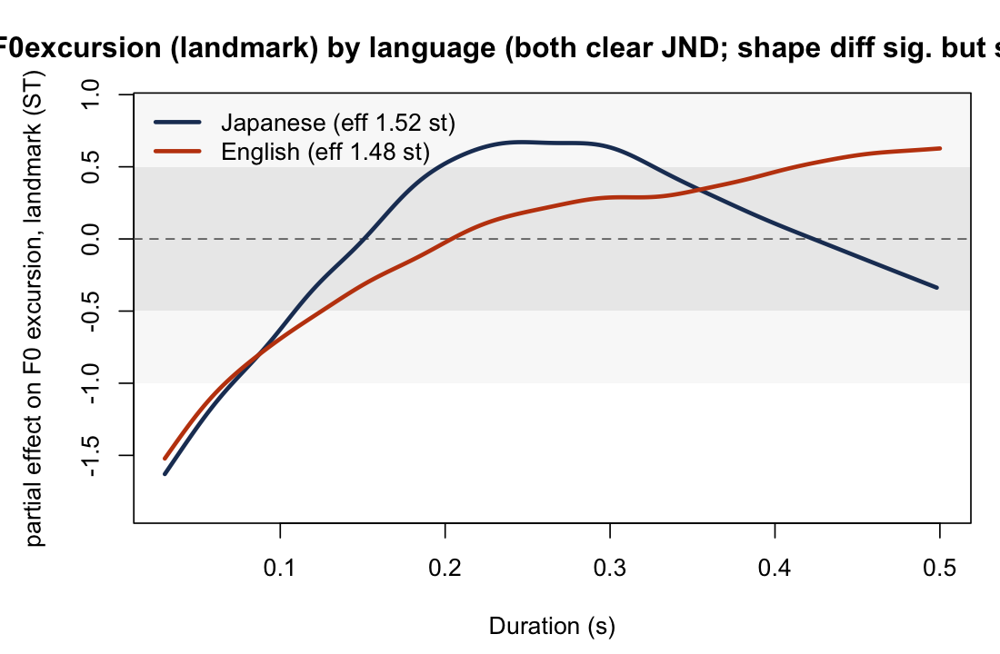
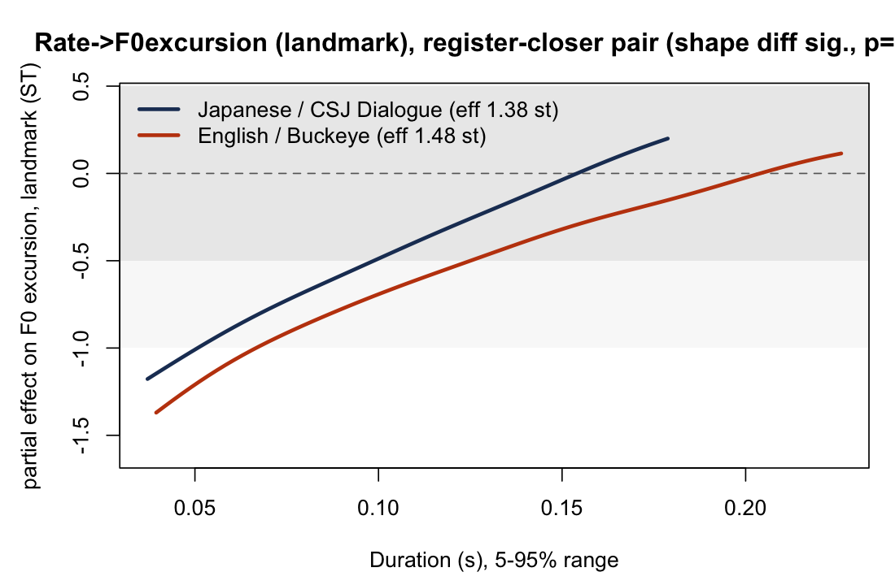
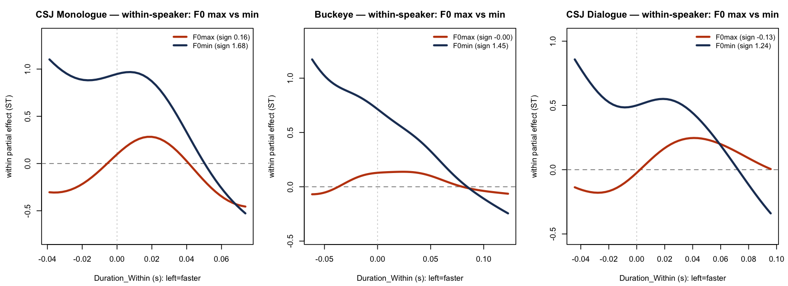
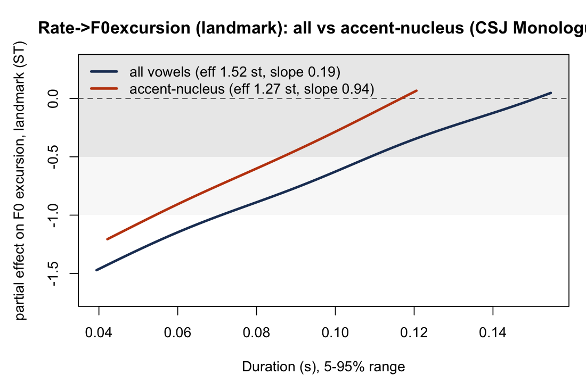

# Speaking rate compresses F0 excursion, not F0 maximum, in spontaneous speech

Takeshi Ishihara

Department of English Language Studies, Faculty of Foreign Language Studies, Mejiro University, 4-31-1 Nakaochiai, Shinjuku-ku, Tokyo 161-8539, Japan

E-mail: ishihara@mejiro.ac.jp

## Abstract

Speaking rate is widely assumed to affect fundamental frequency (F0) through temporal undershoot, but this assumption derives from laboratory speech under instructed rate change, and it is unclear whether it holds for the local, endogenous rate variation of spontaneous speech or whether it depends on how F0 realization is measured. We examined rate–F0 covariation across three spontaneous datasets—Japanese academic monologue, American English conversational interviews, and Japanese face-to-face dialogue (89 speakers; 392,163 vowel tokens)—and two languages, modeling local rate (vowel duration) against F0 maximum and excursion with generalized additive mixed models. F0 maxima showed only a small effect of local rate in every dataset (0.3–0.7 semitones), within or below standard perceptual benchmarks. F0 excursion, by contrast, contracted reliably in fast speech across all three datasets and both languages (1.4–1.8 semitones, exceeding a static pitch-discrimination benchmark throughout; in Japanese monologue also clearing a stricter movement benchmark stably (bootstrap 95% CI ≥ 1.54 st)). The effect was predominantly within-speaker in origin (1.4–1.7 semitones); the compression was carried primarily by a rise in F0 minima rather than a fall in F0 maxima. It generalized across languages, the cross-linguistic gap narrowing substantially when interactional register was matched, and survived restriction to accent-nucleus vowels and a battery of robustness checks (see Methods). Undershoot-based predictions for F0 thus generalize to spontaneous speech, but only when F0 realization is assessed as excursion rather than peak height—a distinction that may account for discrepancies among prior studies.

# 1. Introduction

Fundamental frequency (F0) is central to the phonetic realization of prosodic structure, encoding prominence, phrasing, and intonational contrast across languages. Because tonal targets are executed within time windows delimited by segmental and prosodic structure, their phonetic realization is inherently constrained by the temporal organization of speech. Speaking rate is therefore expected to shape F0 realization, linking the temporal domain to laryngeal control (Lindblom, 1963; Arvaniti, 2016). This expectation is not merely mechanical: the realization of tonal targets has been shown to depend on a range of phonetic and phonological factors—including speaking rate, syllable structure, phonological weight, and adjacent tones—rather than on invariant target coordinates (Arvaniti, Grice, & D'Imperio, 2026). How F0 is modulated under varying temporal conditions thus bears on models of prosodic timing and, more broadly, on how systematic the moment-to-moment variability of spontaneous speech actually is.

A dominant account in laboratory phonetics holds that increases in speaking rate reduce the time available for articulatory gestures, yielding incomplete realization of phonetic targets. Originally formulated for vowel formants (Lindblom, 1963; Moon & Lindblom, 1994), this undershoot framework was extended to F0 on the assumption that reduced time constrains pitch-target approximation just as it constrains formant approximation (Gay, 1981; Xu & Wang, 2001). Gay (1981), for instance, showed that faster rates reorganize articulatory strategies — altering displacement, velocity, and coarticulation together — rather than producing a passive, time-proportional undershoot, so that even for vowel formants the mapping from reduced time to reduced target attainment is not straightforward. The clearest empirical support for this extension comes from French: Fougeron and Jun (1998) found that for two of three speakers, an increase in rate reduced pitch range and pitch displacement, with the F0 maxima lowered more than the F0 minima—the pattern predicted if faster speech compresses the attainment of high tonal targets. Rate has also been shown to influence the temporal alignment of F0 peaks with the segmental string (Prieto & Torreira, 2007), suggesting that temporal constraints can shape multiple dimensions of F0 realization.

Two features of this evidence base, however, limit its reach for spontaneous speech. First, it rests almost entirely on *elicited* rate variation: speakers read prepared materials or are instructed to speak fast or slow, producing intentional, globally coordinated shifts in tempo. The studies cited above are, without exception, based on read or laboratory speech. Naturally occurring speech instead varies locally and unintentionally, with rate fluctuating from moment to moment under the pressures of planning, discourse organization, and interaction (Cole, Mo, & Hasegawa-Johnson, 2010; Trouvain & Grice, 1999). Second, even within the elicited tradition, reported effects of rate on F0 realization are not uniform. Caspers and van Heuven (1993) found that rate affected the slope of Dutch pitch rises but had inconsistent effects on overall F0 level, and Ladd et al. (1999) found that rate strongly affected the duration of English accentual F0 rises but had only small and inconsistent effects on both the alignment and the excursion size of the F0 movement itself. A comparable pattern was found for Japanese: in a controlled comparison of normal and fast speech, an increase in rate shifted the F0 peak later, but the shift did not reach significance (Ishihara, 2006). Whether a relationship established under global, instructed manipulation governs the *local, endogenous* rate fluctuations of spontaneous speech is an open empirical question—and one on which the ecological validity of the undershoot prediction for F0 depends.

Second, prior work has not distinguished the *locus* of any rate–F0 association. A statistical relationship between rate and F0 could reflect a within-speaker coupling—the same speaker's F0 shifting as they speed up and slow down—or a between-speaker regularity, whereby habitually faster talkers happen to differ in pitch. These are mechanistically distinct, and only the former bears on the undershoot logic, which is a claim about time pressure within an utterance. Separating them requires decomposing the rate variable into within- and between-speaker components—a mean-deviation approach that has been used to separate the effect of a speaker's habitual rate from moment-to-moment rate fluctuation in other domains of connected speech (Tanner et al., 2017)—but has not previously been applied to rate–F0 covariation in spontaneous speech. A further consideration is that of *magnitude and measurement*. Corpus-scale data render even trivial effects statistically significant, so significance alone cannot establish that a rate–F0 relationship is perceptually or mechanistically consequential; a meaningful interpretation requires that the estimated effect be evaluated against a perceptual benchmark—for accent-lending F0 movements, differences on the order of 1.5 semitones are needed to alter perceived prominence (Rietveld & Gussenhoven, 1985)—rather than against the null of zero alone. Moreover, undershoot is standardly formulated as a claim about F0 *excursion*, the extent of a local pitch movement, rather than about F0 *height* per se: a peak F0 value can be elevated by phrase-level pitch register largely independently of how compressed the local excursion is. Whether rate–F0 covariation in spontaneous speech is better characterized at the level of F0 maxima or of F0 excursion has not, to our knowledge, been systematically compared.

We therefore ask two related questions. First, does the covariation between local speaking rate and F0 in spontaneous speech depend on how F0 realization is measured—as a *maximum*, reflecting momentary pitch height, or as an *excursion*, reflecting the magnitude of the local pitch movement itself? Second, for whichever measure shows a perceptually meaningful effect, is that effect within-speaker in origin—consistent with a moment-to-moment physiological coupling between rate and F0 realization (Titze, 1989; Strik & Boves, 1995)—or does it instead reflect a between-speaker regularity that would leave the undershoot logic unsupported? We address these questions across three spontaneous-speech datasets spanning a gradient of interactional demand: Japanese academic monologue, American English interview speech, and Japanese face-to-face dialogue. Using generalized additive mixed models, we estimate the rate–F0 function separately for F0 maxima and F0 excursion, evaluate each against the perceptual benchmark for F0, and apply a within–between decomposition to locate any effect that survives this benchmark. Because a corpus-derived excursion measure is vulnerable to artifacts that could masquerade as a rate effect, we further subject it to a battery of robustness checks: for sampling artifacts tied to the number of voiced frames available in short vowels, for a general loudness or vocal-effort confound, and, for Japanese, for peak delay (*ososagari*), whereby the F0 peak of a word-initial accent is characteristically realized outside the accented syllable itself and can therefore fall outside a vowel-internal measurement window (Sugito, 1982; Ishihara, 2003). As we show, F0 maxima carry no perceptually meaningful signature of local rate in any dataset, whereas F0 excursion contracts reliably in fast speech—in the direction predicted by undershoot—at a magnitude that survives each of these checks and that is not restricted to any one language or interactional context.

# 2. Method

## 2.1 Corpora

Three speech corpora were analyzed, representing two languages and a range of interactional demand: spontaneous Japanese monologue, spontaneous Japanese dialogue, and conversational American English.

*Japanese monologue.* The Corpus of Spontaneous Japanese (CSJ; Maekawa, 2003) provided academic-presentation monologue from 31 speakers.

*Japanese dialogue.* The CSJ Dialogue subset comprises face-to-face conversations recorded on two channels, one per participant, with a single orthographic/phonetic annotation tier per session. Because the annotation does not by itself specify which channel a given labeled interval belongs to, we verified speaker attribution empirically (§2.3) before treating each session as contributing one speaker per dominant channel, yielding 18 speakers across 18 sessions (channel selection: 3 sessions dominant on the left channel, 15 on the right).

*American English conversational speech.* The Buckeye Corpus of conversational speech (Pitt, Johnson, Hume, Kiesling, & Raymond, 2005) provided interview-based speech from 40 speakers.

Table 1 summarizes the final, post-filter token counts.

| Corpus | Language | Speakers | Short-vowel tokens | Long-vowel tokens | Total tokens |
|---|---|---:|---:|---:|---:|
| CSJ Monologue | Japanese | 31 | 81,687 | 11,469 | 93,156 |
| CSJ Dialogue | Japanese | 18 | 21,558 | 3,176 | 24,734 |
| Buckeye | English | 40 | — | — | 274,273 |
| **Total** | | **89** | | | **392,163** |

English (Buckeye) vowels are not categorized by phonological length; the short-/long-vowel distinction applies only to the Japanese corpora (CSJ).

## 2.2 Acoustic extraction and vowel selection

F0 was extracted using Praat via the Parselmouth interface, with a pitch floor of 75 Hz, a pitch ceiling of 600 Hz, and a 10 ms frame step. Vowel intervals were drawn from the corpora's forced-aligned or manually verified segmentations: CSJ provides phonetic segmentation produced by automatic alignment with subsequent manual correction (Maekawa, 2003), and Buckeye provides phonemic labels produced under a comparable protocol of automatic alignment followed by manual transcriber correction, with inter-transcriber reliability separately assessed by the corpus creators (Pitt et al., 2005). All vowel categories represented in each corpus's phoneme inventory were eligible for inclusion, subject only to the acoustic filtering criteria described below; no vowel quality was excluded a priori. For Japanese, the CSJ segmental tier explicitly distinguishes vowel length, so the vowel inventory comprised the five short vowels (a, i, u, e, o) together with their five phonologically long counterparts (aH, iH, uH, eH, oH), treated as ten distinct vowel categories; for English, by contrast, nasalized vowels — marked separately in the Buckeye transcription (see below) — were excluded, because nasalization couples the nasal cavity and perturbs the pitch signal in a way that would confound the excursion measure. Tokens were excluded if (a) vowel duration fell outside 0.03–0.50 s, (b) fewer than three voiced frames were available within the vowel interval, or (c) an octave-jump artifact was detected, operationalized as an absolute frame-to-frame F0 change exceeding 50 Hz — the latter criterion serving, along with the exclusion of unvoiced frames, as a coarse control against the most severe voice-quality irregularities (e.g., creaky-voice octave errors); no independent voice-quality classification (e.g., of breathy or creaky phonation) was performed, and this is noted as a limitation in §4.7. Supplementary Table S1 gives the exclusion breakdown by corpus and criterion (criteria applied independently, not sequentially).


For Buckeye, an additional 3,361 nasalized-vowel tokens were excluded separately prior to the above filtering (nasalization is orthogonally marked in the Buckeye transcription and was not treated as a duration/voicing/jump criterion). Full N-audits (input, used, dropped, and speakers-per-model) are reported alongside each statistical model below and were verified to show zero unexplained token loss between the filtered master dataset and each model's fitted N.

## 2.3 CSJ Dialogue speaker attribution

CSJ Dialogue sessions are distributed as one segmentation/annotation tier (TextGrid) accompanied by two channel-separated audio files (left and right), reflecting the two participants recorded on separate microphones. Because a single annotation tier does not indicate which channel's audio a given labeled interval corresponds to, we verified empirically that each session's annotated intervals belong predominantly to a single talker by comparing per-segment RMS energy across the two channels: for annotated intervals, one channel's RMS energy was consistently an order of magnitude larger than the other's (session-level channel dominance was often extreme — e.g., one session yielded 24 valid tokens on its non-dominant channel against 1,408 on its dominant channel), consistent with the annotation tracking one speaker's turns while the other channel's audio is comparatively distant/attenuated cross-talk. We therefore selected, per session, the channel with the higher RMS energy over annotated intervals as the "dominant" channel, extracted F0 only from that channel, and treated speaker identity as session-by-dominant-channel (18 speakers across 18 sessions, 3 left-dominant and 15 right-dominant). To quantify the consequence of this choice directly, we compared, under identical extraction and filtering criteria, a channel-naïve treatment that measures F0 on both channels against the single annotation tier (treating each session as two speakers) against the dominant-channel-only treatment adopted here: the naïve treatment yields 29,302 post-filter tokens, of which 4,568 (15.6%) derive from the non-dominant channel and would constitute a spurious second speaker per session under the naïve treatment; the dominant-channel-only treatment yields the 24,734 tokens used throughout this study.

## 2.4 Dependent variables

Vowel duration was used as the index of local speaking rate because, unlike global rate measures such as syllables per second, it directly reflects the temporal resources available for F0 realization at the site of pitch-target execution; it does not, however, capture all dimensions of speaking rate (e.g., pausing, articulation rate over a wider window), a limitation returned to in §4.7.

Three per-vowel F0 measures were derived from the extracted pitch track; all are reported in semitones (re 1 Hz) to linearize the perceptual scale.

### 2.4.1 F0 maximum
The maximum F0 value across all voiced frames within the vowel interval, converted to semitones (`F0_ST`). This corresponds to what a single-point pitch-target measure of F0 realization would yield, and is retained here as a contrast to the excursion-based measures defined below (§2.4.3), in order to test whether rate–F0 covariation depends on which dimension of F0 realization is examined.

### 2.4.2 Raw excursion
The semitone difference between the maximum and minimum F0 values across all voiced frames within the vowel interval (`F0_range_ST = 12·log2(f0_max / f0_min)`). This measure is reported only for contrast: as detailed in §2.7.1, it is subject to a frame-count sampling artifact and is not used as a primary dependent variable.

### 2.4.3 Fixed-landmark excursion (primary DV)
To obtain an excursion measure whose statistical properties do not depend on how many voiced frames a vowel happens to contain, F0 was sampled at five fixed proportional positions within each vowel interval — 10%, 30%, 50%, 70%, and 90% of the interval's duration — by linear interpolation over the voiced-frame F0 track, with values at the interval edges clamped to the nearest available voiced frame. These five interior positions were chosen to capture the shape of the pitch contour across the whole vowel while keeping the sampled points away from the interval edges, where pitch tracking is least reliable and most affected by consonantal coarticulation. The fixed-landmark excursion (`F0_excursion_LM_ST`) is the semitone difference between the maximum and minimum of these five interpolated values. Because exactly five points are sampled regardless of vowel duration or the number of underlying voiced frames, this estimator is time-scale invariant by construction (§2.7.1 verifies this empirically). The corresponding landmark-based F0 minimum and maximum (`F0_LMmin_ST`, `F0_LMmax_ST`) — the smaller and larger, respectively, of the five interpolated values — were also retained, for the mechanistic decomposition reported in §3.5/§4.3.

The fixed-landmark excursion is the primary dependent variable for all analyses reported below unless otherwise noted; F0 maximum is retained as a contrast measure to address whether rate–F0 covariation depends on the F0 dimension examined (§1).

## 2.5 Accent-nucleus tagging (X-JToBI)

For CSJ Monologue and CSJ Dialogue, the CSJ's X-JToBI tone-tier annotation (Maekawa, Kikuchi, Igarashi, & Venditti, 2002) was used to identify vowels bearing an accentual fall (label 'A' or 'Ax'), i.e., vowels for which a pitch target is explicitly posited under current intonational-phonological analysis, rather than assumed by default for every vowel. A vowel was tagged as a *strict* accent-nucleus token if the tone-tier 'A'/'Ax' point fell within that vowel's own interval (`AccentDist == 0`, i.e., the tone-tier point's timestamp lay at or after the vowel's start boundary and before its end boundary); as a *near* accent-nucleus token if the nearest such point fell within 0.10 s of the vowel interval; and the label-to-vowel distance threshold was additionally swept from strict assignment through 0.15 s to assess sensitivity to this choice (§3.6). We use 'accent-nucleus' throughout as a label for this operational category — vowels bearing an annotated accentual fall — rather than as a claim that these vowels are the theoretical tonal nucleus in every case; as §3.6 discusses, this operational definition does not always coincide with the lexically accented mora. Buckeye has no comparable tone-tier annotation and was not included in accent-nucleus analyses.

## 2.6 Statistical modeling

### 2.6.1 GAMM specification and effect-size metric
Generalized additive mixed models (GAMMs) were fit using the `mgcv` package in R (`bam()`, method `fREML`, `discrete = TRUE`). The base model specification was:

```
DV ~ s(Duration, k = 20) + s(Duration, Speaker, bs = "fs", m = 1, k = 5) + s(Vowel, bs = "re")
```

where the factor smooth `s(Duration, Speaker, bs = "fs")` allows speaker-specific deviation in the shape of the rate–F0 function, and `s(Vowel, bs = "re")` is a random intercept for vowel identity, controlling for the intrinsic pitch differences between vowel categories (Whalen & Levitt, 1995) so that the estimated rate effect is not confounded with the corpus's particular mixture of vowel types. For cross-linguistic comparisons, `Language` was added as a parametric term together with a language-conditioned duration smooth (`s(Duration, by = Language)`); for the Japanese monologue-versus-dialogue comparison, an ordered-factor difference-smooth structure was used analogously (`s(Duration, by = StyleO)`) to test whether the shape of the rate–F0 function differs between styles while retaining a shared reference smooth.

Rather than relying on statistical significance alone — which, at the sample sizes involved here (tens to hundreds of thousands of tokens per model), renders even trivial effects "significant" — the primary outcome for every model was the **5th-to-95th-percentile effective range** of the fitted population-level smooth term for Duration, i.e., the vertical range of that smooth across the 5th-to-95th-percentile window of the observed duration distribution — its maximum minus its minimum fitted value over that window — converted to semitones. This range equals the signed difference between the smooth's values at the two percentile endpoints when the smooth is monotonic, but can exceed that endpoint difference when it is not (as for F0 maximum, whose fitted smooth is non-monotonic and whose full-range linear slope even changes sign; see the ‡ note to Table 2). This robust range avoids the extrapolation instability of the smooth's extreme tails while still capturing the great majority of the observed rate variation. A per-100 ms slope was also computed via linear approximation to the same fitted values, for ease of comparison to prior literature reporting rate effects in these units.

A nonparametric (GAMM) rather than linear (LMEM) specification was adopted because the rate–F0 relationship is not assumed, and does not appear, to be linear: the population-level partial effects plotted throughout §3 show a compressive, decelerating shape at short durations and a flattening at long durations rather than a constant slope (Figure 1), and a linear model would misrepresent this functional form and could bias the 5–95% effective range depending on where in the duration distribution the (mis-specified) linear fit happened to be anchored. The GAMM framework additionally allows two features used throughout this study that have no natural linear-mixed-model equivalent: a factor smooth for speaker-specific curvature (§2.6.1, model specification above), used to test whether speakers differ not just in intercept but in the shape of their rate–F0 function (§3.5), and an ordered-factor difference smooth, used to test whether the shape of the function differs by speaking style or language (§3.3–3.4) without presupposing a particular parametric form for either curve. Because the same modeling framework, and the same effect-size metric, is used for F0 maximum, raw excursion, and the fixed-landmark excursion alike, the three measures compared in §3.1 are directly comparable to one another. Basis-dimension adequacy and the collinearity between smooth terms (concurvity), which becomes relevant when covariate-adjusted models are used to test specific confounds, are addressed in §2.7.1 and revisited in the Discussion (§4.7).

### 2.6.2 Perceptual benchmarks
Effective ranges were evaluated against two perceptual benchmarks rather than against a null of zero. A static pitch-discrimination benchmark of 0.5–1.0 semitones reflects general just-noticeable-difference (JND) estimates for pitch distance ('t Hart, 1981). Because the primary dependent variable is an excursion — the magnitude of a local pitch movement, not a static level — we additionally evaluated effects against the stricter benchmark of 1.5 semitones needed to alter perceived prominence for accent-lending F0 movements specifically (Rietveld & Gussenhoven, 1985). An effect is reported as perceptually meaningful only when it clears the relevant benchmark for the dimension being measured (1.0 st as the primary excursion threshold, with 1.5 st reported as the stricter movement-specific benchmark throughout).

### 2.6.3 Within–between (Mundlak) decomposition
To distinguish a within-speaker, moment-to-moment coupling between rate and F0 excursion from a between-speaker regularity (habitually faster speakers differing systematically in their excursions), vowel duration was decomposed, following a mean-deviation approach used elsewhere to separate a speaker's habitual rate from token-level rate fluctuation in modeling connected-speech phenomena (Tanner et al., 2017), into a between-speaker component (`Duration_Between`, each speaker's mean duration across all their tokens) and a within-speaker component (`Duration_Within`, each token's deviation from its speaker's mean). The decomposition model was:

```
DV ~ Duration_Between + s(Duration_Within, k = 20) + s(Duration_Within, Speaker, bs = "fs", m = 1, k = 5) + s(Vowel, bs = "re")
```

The within-speaker effect was assessed via the 5th-to-95th-percentile effective range of `s(Duration_Within)`, using the same benchmark logic as §2.6.2; the between-speaker effect was assessed via the linear coefficient on `Duration_Between` and its associated *p*-value. This decomposition was applied both to the primary excursion DV and, separately, to the landmark-based F0 minimum and F0 maximum, in order to locate which pole of the pitch range (floor or ceiling) carries any within-speaker excursion effect (§3.5/§4.3).

### 2.6.4 Bootstrap confidence intervals and speaker robustness
To quantify the uncertainty of the effective-range estimates, 95% confidence intervals were computed by a speaker-cluster bootstrap: speakers were resampled with replacement (all of a speaker's tokens retained, and resampled speakers relabelled to distinct levels), the GAMM was refit, and the 5–95% effective range recomputed, over 1,000 replicates (seed 2026); the 2.5th and 97.5th percentiles of the bootstrap distribution define the interval. Because the movement-relevant benchmark (1.5 st) lies close to the observed effective ranges, this interval is the basis for judging whether a benchmark is cleared stably. The effective range was additionally recomputed with each speaker removed in turn (leave-one-speaker-out) to verify that no single speaker drives the effect. These procedures were applied to the landmark-excursion effective range for each corpus (Table S).

## 2.7 Robustness checks

Because a corpus-derived excursion measure computed from a variable number of observed F0 frames per vowel is vulnerable to artifacts unrelated to any true rate–F0 coupling, the primary DV was subjected to four classes of robustness check prior to, and independent of, the substantive analyses reported in §3.

### 2.7.1 Frame-count sampling artifact
Because shorter (faster) vowels yield fewer voiced F0 frames, a raw maximum-minus-minimum excursion computed over all available frames is subject to a downward order-statistic bias in short vowels unrelated to any true compression of the underlying F0 trajectory. This was diagnosed in four steps: (i) the correlation between vowel duration and the number of voiced frames available (`num_valid`) was computed per corpus; (ii) `num_valid` was added as a covariate smooth to the raw-excursion GAMM, with the resulting shrinkage in the Duration effect size reported alongside a concurvity diagnostic (given the near-deterministic relationship between duration and frame count, this covariate-adjustment estimate is treated as an upper bound on the artifact rather than a definitive one); (iii) the Duration effect was re-estimated within a fixed narrow band of frame counts (5–7 voiced frames), to ask whether Duration predicts the raw excursion even when frame count is held approximately constant; and (iv) a span-preserving downsampling procedure reduced the frame count of long vowels to a fixed four points while holding the vowel's full time span constant (rather than contiguously slicing a sub-interval, which — as an earlier, superseded resampling test in this pipeline showed — collapses the excursion for the wrong reason, by sampling a flat plateau rather than a time-compressed gesture). This span-preserving test is the decisive one: it isolates the pure effect of frame count from the effect of time compression itself. The fixed-landmark excursion (§2.4.3) was validated against raw excursion using the same four diagnostics, since its five-point, proportional-time sampling scheme is time-scale invariant by construction and should therefore show little or no artifact under (iv).

### 2.7.2 Alternative excursion definitions
In addition to the raw and fixed-landmark excursion measures, three further excursion definitions were computed for robustness comparison: a percentile-based excursion (the semitone difference between each vowel's 95th- and 5th-percentile F0 values across voiced frames, less sensitive to single-frame extrema than raw max-minus-min); a per-speaker winsorized excursion (F0 extrema capped at each speaker's own 99.5th percentile before computing the range, to limit the influence of octave or creaky-voice outliers); and a version of the raw excursion excluding tokens flagged with a suspect F0 minimum (values at or near the pitch floor, or far below the corpus-wide 5th percentile, potentially reflecting creaky voice or tracking error rather than a true low pitch target).

### 2.7.3 Intensity (loudness) confound
To test whether any excursion effect reflects general vocal effort or loudness scaling rather than a pitch-specific mechanism, intensity (dB) was extracted from the same vowel intervals and frame definitions used for F0, yielding per-vowel maximum, mean, and range intensity measures. The correlation between vowel duration and maximum intensity was computed per corpus, and maximum (and, separately, mean) intensity was added as a covariate smooth to the primary excursion GAMM, with the resulting change in the Duration effective range reported as the diagnostic of confounding.

### 2.7.4 Peak delay (*ososagari*)
Because word-initial accentual pitch peaks in Tokyo Japanese are characteristically realized outside the accented syllable itself for light (CV+CV, CVCV) initial-syllable structures — the phenomenon of *ososagari*, established independently of speaking rate (Sugito, 1982; Ishihara, 2003) — a vowel-internal excursion measure risks systematically under-capturing the true pitch movement for exactly this subset of tokens. Using the X-JToBI tone tier (§2.5), tokens were flagged where the accentual fall ('A'/'Ax') point fell within the *following* vowel's interval rather than the current one (an adjacency window of 0.15 s was used to define "following"). For flagged tokens, the landmark excursion computed over the current vowel alone was compared to a concatenated-interval excursion computed by extending the five-landmark sampling window to span the current vowel plus the following vowel, quantifying the degree of under-capture. The primary Duration effect was then re-estimated excluding flagged tokens, to assess whether the headline rate–excursion relationship depends on this subset (§3.6, §4.5).

# 3. Results

## 3.1 Effect size: F0 maximum versus F0 excursion

Table 2 reports the 5th-to-95th-percentile effective range of the population-level rate smooth for each corpus and each of the three F0 measures defined in §2.4; for the two Japanese corpora these effect sizes are computed on the full ten-level vowel model (five short plus five phonologically long categories). F0 maximum showed effective ranges of 0.34–0.68 semitones across the three corpora. This falls within the static perceptual benchmark range (0.5–1.0 st) for CSJ Monologue and CSJ Dialogue, and below it for Buckeye (0.34 st, the largest corpus, N = 274,273). The raw excursion measure, computed over all voiced frames, showed substantially larger effective ranges (1.90–2.16 st, clearing both benchmarks in every corpus); however, as detailed in §3.1.1 below, this measure is inflated by a sampling artifact. The fixed-landmark excursion — the primary dependent variable — showed effective ranges of 1.44–1.76 semitones, clearing the 1.0 st benchmark in every corpus. A speaker-cluster bootstrap (§2.6.4; Table S) confirmed that the 1.0 st benchmark is cleared stably in all three corpora (95% CIs [1.54, 2.05], [1.33, 1.63], and [1.11, 1.74] for CSJ Monologue, Buckeye, and CSJ Dialogue; all lower bounds above 1.0 st). For the stricter 1.5 st movement benchmark the corpora diverge: CSJ Monologue clears it stably (point estimate 1.76 st, bootstrap 95% CI lower bound 1.54 st, above 1.5), whereas Buckeye (1.48 st) and CSJ Dialogue (1.44 st) clear 1.0 st stably but have 95% CIs that straddle 1.5 st, so for these two corpora clearing the movement benchmark remains suggestive rather than firmly established. A leave-one-speaker-out analysis further indicated that no single speaker drives the effect — removing any one speaker left the effective range at 1.70–1.81 st for CSJ Monologue, 1.38–1.51 st for CSJ Dialogue, and 1.45–1.51 st for Buckeye, always above the 1.0 st benchmark (Table S). In every corpus and for every excursion measure, the direction of the effect was that excursion contracted at short (fast) durations relative to long (slow) ones.

| Corpus | DV | Effective range (5–95%, st) | 95% CI (st) | Slope (st/100 ms) | Clears 1.0 st benchmark | Clears 1.5 st movement benchmark† |
|---|---|---:|:--:|---:|:--:|:--:|
| CSJ Monologue | F0 maximum§ | 0.68 | — | -0.59‡ | — | — |
| CSJ Monologue | Raw excursion | 2.16 | — | 0.45 | ✓ | ✓ |
| CSJ Monologue | **Landmark excursion** | **1.76** | **[1.54, 2.05]** | 0.25 | ✓ | ✓ |
| Buckeye | F0 maximum§ | 0.34 | — | 0.12 | — | — |
| Buckeye | Raw excursion | 1.98 | — | 0.56 | ✓ | ✓ |
| Buckeye | **Landmark excursion** | **1.48** | **[1.33, 1.63]** | 0.39 | ✓ | — |
| CSJ Dialogue | F0 maximum§ | 0.60 | — | -0.08‡ | — | — |
| CSJ Dialogue | Raw excursion | 1.90 | — | 0.44 | ✓ | ✓ |
| CSJ Dialogue | **Landmark excursion** | **1.44** | **[1.11, 1.74]** | 0.24 | ✓ | — |

† Effective ranges and 95% CIs for the fixed-landmark excursion are from the full ten-level (short + long) vowel model. In that model the CSJ Monologue bootstrap 95% CI lower bound (1.54 st) exceeds 1.5 st, so the movement benchmark is cleared stably (✓); for Buckeye and CSJ Dialogue the 95% CI straddles 1.5 st, so it is not (see §2.6.4, Table S).

‡ For CSJ Monologue and CSJ Dialogue, the full-range linear slope for F0 maximum is negative due to non-monotonic behavior at the extremes of the extended duration range (which now includes long vowels); the 5–95% effective range, the primary effect-size metric used throughout, remains stable and is unaffected by this.

§ The weak rate effect on F0 maximum is not an artifact of comparing across measures with different numbers of sampling points: when F0 maximum is instead computed from the same five fixed-proportion landmarks used for the excursion measure, the population-level 5–95% effective range is 0.21–0.59 st (CSJ Monologue 0.59, Buckeye 0.21, CSJ Dialogue 0.50), if anything smaller than the all-frame estimate reported above (0.34–0.68 st).




## 3.1.1 Frame-count artifact diagnostics

Vowel duration and the number of voiced F0 frames available within a vowel were near-deterministically related (Pearson *r* = 0.886–0.918 across corpora; median frame count of 7, ranging from the minimum of 3 imposed by the filtering criterion up to 48–50). Adding frame count as a covariate smooth to the raw-excursion model shrank the Duration effective range by 46–80%, but the concurvity between Duration and frame count in this covariate model was 0.97–0.98, indicating that this shrinkage is better read as an upper bound on the possible artifact than as a clean estimate of it. Within a fixed, narrow band of frame counts (5–7 voiced frames per vowel), Duration still predicted raw excursion, but with a substantially reduced effective range (0.33–0.62 st) — below the perceptual benchmark in every corpus.

The most direct test held each vowel's full time span constant while reducing its frame count: downsampling long vowels to four evenly spaced points across their original span reduced the raw excursion by only 6.9% and the fixed-landmark excursion by only 0.7%, indicating that the pure frame-count (order-statistic) component of the artifact is small. Combined with the finding that raw excursion is 23–34% larger than landmark excursion across corpora (22.7%, 33.8%, and 31.9% for CSJ Monologue, Buckeye, and CSJ Dialogue; Table 2), we conclude that raw max-minus-min excursion is inflated by oversampling long vowels relative to short ones, but that the underlying rate–excursion relationship is largely genuine. Because the fixed-landmark excursion samples a constant number of points regardless of vowel duration, it is time-scale invariant by construction: a vowel-length-independent "same gesture, executed faster" would yield a landmark effective range of zero. That the landmark measure instead shows a 1.44–1.76 st effect — and that this effect is essentially unchanged when restricted to well-sampled vowels (num_valid ≥ 5: 1.28–1.57 st) — indicates that it is not an artifact of under-resolved short vowels. The fixed-landmark excursion is therefore adopted as the primary dependent variable for all subsequent analyses; the raw excursion measure is reported only where explicitly noted for contrast.




## 3.2 Robustness to excursion definition

The landmark excursion effect was compared against three further excursion definitions (§2.7.2): a percentile-based excursion, a per-speaker winsorized excursion, and a version of the raw excursion excluding tokens with a suspect F0 minimum (4.7% of tokens pooled across corpora). Every definition, in every corpus, cleared the 1.0 st static benchmark; the most conservative definition (percentile-based) yielded 1.58–1.83 st, with the spread across all four definitions within a given corpus amounting to only 15–18% of the raw-excursion value. The effect is therefore not an artifact of any single excursion operationalization, nor of a small number of tokens with extreme or suspect F0 extrema.




## 3.3 Style-invariance within Japanese

Because CSJ provides both monologue and dialogue recordings from the same language, we tested whether the rate–excursion function differs by speaking style within Japanese, independent of any cross-linguistic comparison. An ordered-factor difference-smooth model comparing CSJ Monologue and CSJ Dialogue showed no significant difference in the shape of the rate–excursion curve between styles (difference smooth *p* = .536), with no significant effect of style on the overall level of excursion (*p* = .350). The per-style effective ranges were 1.76 st (Monologue) and 1.44 st (Dialogue), despite the two styles differing substantially in interactional demand — dialogue involves real-time turn-taking with a co-present interlocutor, while monologue does not. The rate–excursion relationship is therefore not a by-product of speaking style within Japanese.




## 3.4 Cross-linguistic generality

Comparing CSJ Monologue (Japanese) to Buckeye (English) — the register-mismatched pairing available in this design — the landmark excursion effect cleared the 1.0 st benchmark in both languages (Japanese 1.76 st; English 1.48 st, N = 367,429 combined). The difference smooth comparing the two languages' rate–excursion curves was statistically significant (*p* = 6.2 × 10⁻⁶), and the magnitude gap between the two languages' effective ranges was 0.273 st. This gap falls far short of the 1.5 st movement threshold, but it is not negligible; as the register-matched comparison below shows (§3.4.1), the cross-linguistic gap shrinks substantially once interactional demand is equated, indicating that much of it is attributable to the register mismatch between spontaneous monologue and conversational interview rather than to a stable typological difference between the languages. Visually, the two curves also diverge in shape at longer durations (beyond approximately 0.25 s): the Japanese curve turns downward, while the English curve continues to rise. This divergence falls outside the 5th–95th percentile window used to compute the effective range reported above (which extends only to roughly 0.16 s for Japanese Monologue and 0.23 s for Buckeye) and is accordingly a tail phenomenon in a comparatively data-sparse region; we do not offer a confirmed explanation for it here, though a phrase-final or declination-related account seems plausible given that long vowels in both languages are disproportionately phrase-final. A further, untested possibility is that the typological contrast between Japanese mora-timing and English stress-timing shapes how pitch is realized over the long, phrase-final vowels that populate this tail. It does not affect the effective-range conclusion reported above.




## 3.4.1 Generality under tighter register matching

Because CSJ Monologue and Buckeye differ in interactional register as well as in language, we additionally compared CSJ Dialogue — closer to Buckeye in interactional demand, both being face-to-face conversational speech — directly to Buckeye (N = 299,007 combined). The effect again cleared the 1.0 st benchmark in both languages (Japanese/Dialogue 1.44 st; English/Buckeye 1.48 st). Here, too, the difference smooth was statistically significant (*p* = .011), but the magnitude gap between the two languages' effective ranges was only 0.043 st — substantially smaller than the 0.273 st gap in the register-mismatched comparison of §3.4. We report this candidly rather than selectively: on the landmark DV, register matching does not eliminate the statistically detectable difference in curve shape between the two languages (unlike an earlier analysis using the raw excursion measure, where the register-matched difference smooth was non-significant, *p* = .09; see §4 for discussion of this one DV-dependent change in conclusion). The fixed-landmark measure had already been adopted as the frame-count-artifact correction established in §3.1.1, prior to and independently of this register-matched comparison, so its use here does not reflect a dependent variable chosen to produce a particular cross-linguistic outcome. What holds robustly across both pairings is that the effect clears the perceptual benchmark in both languages and that the cross-linguistic magnitude gap depends strongly on register matching: it is perceptually negligible in the register-matched comparison (0.043 st, well below the 0.5 st static benchmark) and larger, though still below the 1.0 st static benchmark, in the register-mismatched one (0.273 st). That equating interactional demand shrinks the gap roughly six-fold — from 0.273 to 0.043 st — supports the register-matching logic pursued throughout this study: much of the apparent cross-linguistic difference is attributable to register rather than to language per se. Generality is therefore supported in effect-size terms, most strongly when register is matched.




## 3.5 Controls and the locus of the effect

**Speaker-specific rate curves.** Model comparison (fREML-based AIC) favored models allowing speaker-specific curvature in the rate–excursion function over models with speaker random intercepts alone, in both the cross-linguistic dataset (ΔAIC = −6,435) and the dialogue-only dataset (ΔAIC = −473). Speakers therefore differ systematically in the shape of their rate–excursion function, beyond a shared population-level trend.

**Segmental control (Buckeye).** Because vowel duration in English covaries with the voicing of the following consonant, we added the presence of a following voiceless obstruent as a fixed effect. This predictor was itself significant (0.126 st, *p* ≈ 7 × 10⁻¹¹²), but its inclusion left the Duration effective range essentially unchanged (1.48 → 1.49 st), indicating that the rate–excursion relationship in Buckeye is not confounded by this segmental property.

**Intensity (loudness) control.** Duration and maximum intensity were only weakly correlated across corpora (*r* = 0.04–0.12), suggesting that fast speech in these data is not strongly louder speech. Adding maximum intensity as a covariate reduced the Duration effective range by only 3–4% in all three corpora (1.76→1.69, 1.48→1.42, 1.44→1.38 st), and by no more than 5% within the accent-nucleus-strict subset (§3.6); a mean-intensity covariate left the effect essentially unchanged (≤1% shift). The rate–excursion relationship is therefore not explained by vowel-level loudness scaling, though intensity is not a direct measure of subglottal pressure or laryngeal tension.

**Within-versus-between-speaker locus.** The Mundlak decomposition (§2.6.3) located the effect within speakers: the within-speaker component of the landmark excursion effect cleared the 1.0 st benchmark in every corpus (Monologue 1.73 st; Buckeye 1.44 st; Dialogue 1.38 st), while the corresponding between-speaker coefficient was non-significant in every corpus (Monologue *p* = .97; Buckeye *p* = .28; Dialogue *p* = .59). As an individual speaker's local rate increases, that speaker's own excursion compresses; there is no evidence that habitually faster speakers simply have systematically smaller excursions than habitually slower ones.

**Acoustic pattern: floor and ceiling.** Applying the same within-speaker decomposition separately to the landmark-based F0 minimum and F0 maximum revealed an asymmetry. Within speakers, F0 minima rose reliably as rate increased in every corpus (1.42–1.60 st, all clearing the 1.0 st benchmark), while F0 maxima remained comparatively flat, in some corpora showing no consistent direction at all (0.21–0.58 st; Buckeye's within-speaker F0-maximum effect was essentially zero). This min-rises/max-flat asymmetry was preserved under two robustness checks that avoid the collinearity problem affecting covariate-adjustment for these level-based measures (a subset of well-sampled vowels, num_valid ≥ 5; and exclusion of the peak-delay-affected tokens identified in §3.6): the F0-minimum effect remained several times larger than the F0-maximum effect under both checks. The excursion compression observed in fast speech is therefore attributable primarily to a rise in the floor of the local pitch range rather than a fall in its ceiling.




## 3.6 Restriction to accent-nucleus vowels, and robustness to peak delay

To address the concern that treating every vowel as bearing an independent pitch target is inconsistent with current intonational-phonological analysis, the rate–excursion relationship was re-estimated after restricting to vowels bearing an X-JToBI-annotated accentual fall (§2.5). The strict accent-nucleus subset — vowels whose tone-tier 'A'/'Ax' point fell within their own interval, comprising 15–17% of tone-annotated vowels — showed effective ranges of 2.07 st (CSJ Monologue, N = 14,456) and 1.72 st (CSJ Dialogue, N = 4,092), both clearing the 1.0 st benchmark. The per-100 ms slope in this subset was 3.3 times steeper than over all vowels in Monologue (0.83 vs. 0.25 st/100 ms) and 2.7 times steeper in Dialogue (0.65 vs. 0.24 st/100 ms). A sweep of the label-to-vowel distance threshold used to assign the accentual fall to a vowel, from strict in-vowel assignment through a 0.15 s window, left the effect stable at 1.76–2.28 st (Monologue) and 1.44–1.80 st (Dialogue), clearing the benchmark throughout. Restricting to tonally targeted vowels does not weaken the rate–excursion relationship; if anything, the effect is stronger per unit time precisely on the vowels for which a pitch target is explicitly posited.

Because word-initial light-syllable (CV+CV, CVCV) accents in Tokyo Japanese characteristically realize their F0 peak outside the accented vowel itself (*ososagari*; §2.7.4), we further checked whether this structural property could account for the observed effect via systematic under-capture of the true excursion in a subset of (disproportionately short) tokens. Using the X-JToBI tone tier, 10.7–11.5% of vowels were identified as having their accentual-fall point fall within the following vowel rather than the current one. For these tokens, the within-vowel landmark excursion did substantially under-capture the true pitch movement (median under-capture of 1.01–1.26 st relative to a concatenated current-plus-following-vowel excursion window), and these tokens were somewhat shorter on average than the corpus median (0.067–0.068 vs. 0.073–0.074 s). Despite this, excluding the affected tokens from the main analysis left the headline effect essentially unchanged (1.76 → 1.79 st in Monologue; 1.44 → 1.44 st in Dialogue): the rate–excursion relationship does not depend on this subset and is not an artifact of peak delay. We note one labeling consequence of this structural property for the accent-nucleus tagging above: in CV+CV/CVCV sequences subject to *ososagari*, the "strict nucleus" tag identifies the post-accentual (second-syllable) vowel that bears the realized accentual fall, rather than the lexically accented mora itself. The rate–excursion conclusion is unaffected by this — both the lexically accented and the peak-bearing vowel show the effect — but the phonological label "nucleus" should be read in this operational sense.




## 3.7 Consistency of the effect across vowel length

Because the main analyses above pool the full ten-level Japanese vowel inventory (five short and five phonologically long categories; §2.2), the pooled effect could in principle be an artifact of combining vowels of different phonological length rather than a genuine within-class rate effect. As an internal-consistency check, the fixed-landmark excursion analysis was repeated separately on the short-vowel and long-vowel subsets of each Japanese corpus and compared with the pooled, all-vowel result. The effect held in the same direction — excursion contracts in fast speech — in every subset. In CSJ Monologue the effective range was 1.52 st for short vowels only, 1.66 st for long vowels only (95% CI [1.36, 2.10], clearing 1.0 st stably), and 1.76 st for the pooled model; in CSJ Dialogue it was 1.38 st (short), 1.07 st (long; 95% CI [0.70, 1.66], straddling 1.0 st, reflecting the much smaller long-vowel sample of 3,176 tokens), and 1.44 st (pooled). The pooled estimate is the largest of the three not because pooling manufactures an effect but because the 5th–95th-percentile duration window over which the effective range is measured widens when the two length classes are combined: in CSJ Monologue the pooled window spans 38–180 ms, reaching both the fast, short-vowel tokens (its lower bound, 38 ms, essentially matches the short-only subset's) and the longer durations contributed by long vowels (its upper bound, 180 ms, exceeds the short-only subset's 155 ms), so it covers more of the monotonically declining rate curve than either subset's narrower window (short-only 38–155 ms; long-only 58–302 ms, which begins too late to capture the fast region at all). The rate–excursion relationship is therefore present within each phonological length class, in the same direction, rather than being an artifact of pooling short and long vowels; in the main model, the intrinsic-pitch and duration differences between the classes are additionally absorbed by the vowel random effect (Table S).

# 4. Discussion

## 4.1 Summary of findings

We asked two questions: whether rate–F0 covariation in spontaneous speech depends on how F0 realization is measured, and, for whichever measure shows a perceptually meaningful effect, whether that effect is within-speaker or between-speaker in origin. The answers were unambiguous. F0 maxima carried no perceptually meaningful signature of local rate in any dataset (0.34–0.68 st, within the static benchmark range for CSJ Monologue and CSJ Dialogue but below it for Buckeye, the largest corpus, at 0.34 st). F0 excursion, measured with a frame-count-robust fixed-landmark estimator, contracted reliably in fast speech across all three datasets (1.44–1.76 st), clearing the 1.0 st benchmark throughout — stably so under a speaker-cluster bootstrap (95% CI lower bounds 1.11–1.54 st); CSJ Monologue additionally cleared the stricter 1.5 st movement threshold stably (bootstrap 95% CI lower bound 1.54 st), whereas Buckeye and CSJ Dialogue cleared 1.0 st stably but had 95% CIs that straddled 1.5 st, so for those two corpora clearing this stricter threshold remains suggestive rather than established. This pattern survived four alternative excursion definitions, restriction to phonologically defined accent-nucleus vowels, a general loudness confound check, and a check for peak delay specific to Japanese. A within–between decomposition located the effect within speakers (1.38–1.73 st, clearing the benchmark in every corpus; between-speaker slopes non-significant), and a further decomposition indicated that the compression is carried primarily by a rise in F0 minima rather than a fall in F0 maxima as speakers speed up.

## 4.2 Resolving the max/excursion discrepancy

The central methodological finding of this study is that *how* F0 realization is measured determines whether a rate effect is detectable at all. This is not a minor technical point: it explains why studies of speaking rate and F0 that rely on a single per-vowel F0 maximum may fail to detect, or may mischaracterize, an underlying rate-sensitive excursion effect. A peak F0 value is jointly determined by the local pitch movement and by the phrase-level register in which that movement is embedded; two vowels with identical excursions can differ in maximum simply because one occurs on a phrase that happens to be pitched higher overall. Averaged over a corpus, this register variability adds noise that a single-point measure like F0 maximum cannot separate from the local, rate-sensitive component of interest, while excursion—the distance between the local minimum and maximum—cancels out much of the register-level variability by construction. This is consistent with prior evidence that overall F0 level and F0 excursion need not pattern together under time pressure (Caspers & van Heuven, 1993; see §4.3 below), and supports the view that a single per-vowel F0 maximum does not constitute an excursion measure and is a poor proxy for the pitch-target dynamics that undershoot theory is actually a claim about.

A second, independent reason the excursion effect might have gone undetected in prior corpus work is artifactual rather than conceptual. A naïve excursion measure—the difference between the highest and lowest F0 values observed across a vowel's voiced frames—is not scale-free: short (fast) vowels yield fewer frames (Duration–frame-count correlations of 0.886–0.918 across corpora), and a maximum-minus-minimum computed over fewer order statistics is mechanically smaller, independent of any true change in the underlying F0 trajectory. We traced this artifact directly: holding a vowel's time span fixed and thinning its frame count from the full set down to four points reduced the raw excursion by only 6.9%, while the same manipulation applied to the fixed-landmark measure reduced it by just 0.7%—showing that the pure sampling artifact is modest, but that raw max–minus–min excursion is nonetheless inflated by roughly 23–34% through the oversampling of long vowels relative to short ones. The fixed-landmark excursion adopted here samples F0 at five duration-independent proportional positions and is therefore time-scale invariant by construction: were the observed compression merely "the same gesture executed faster," this measure would show no rate effect at all. That it instead shows a 1.44–1.76 st compression, robust to four alternative excursion definitions and to restriction on frame count (num_valid ≥ 5: 1.28–1.57 st), indicates that the corpus-level undershoot effect is substantially real rather than a by-product of how F0 extrema are sampled from short vowels.

## 4.3 Acoustic locus of the excursion effect: a rising floor, not a falling ceiling

Decomposing the excursion measure into its constituent F0 minimum and F0 maximum reveals a specific and consistent acoustic pattern. Within speakers, F0 minima rose reliably as rate increased (1.42–1.60 st, all clearing the benchmark), while F0 maxima remained comparatively flat and in some corpora showed no consistent direction at all (0.21–0.58 st; Buckeye's maximum was essentially unmoved, sign ≈ 0). The excursion therefore compresses in fast speech chiefly because the floor of the pitch range rises to meet a largely stationary ceiling, not because the ceiling falls to meet a stationary floor. This asymmetry held under two robustness checks that avoid the collinearity problem that affects covariate-adjustment approaches for these level-based dependent variables (a subset restricted to well-sampled vowels, num_valid ≥ 5; and exclusion of tokens subject to the peak-delay confound described in §4.5), with the F0min effect remaining several times larger than the F0max effect throughout.

This floor-raising pattern has a direct precedent, though not a uniform one, in the elicited-speech literature. Caspers and van Heuven (1993) reported that their two Dutch speakers raised overall F0 level at fast rate in qualitatively different ways: one speaker raised F0 minima more than maxima, yielding a *smaller* excursion at fast rate—exactly the pattern found here—while the other raised maxima more than minima, yielding a larger one. That a single elicited speaker already showed the floor-raising pattern, without it being general across their small sample, is consistent with a mechanism that is physiologically available but not obligatory under instructed, global rate manipulation; the present results suggest that it is the dominant pattern in local, endogenous rate variation in spontaneous speech. A floor-raising account is also compatible with the established relationship between subglottal pressure, laryngeal tension, and F0 (Titze, 1989; Strik & Boves, 1995): if faster local speech co-occurs with transiently elevated respiratory or laryngeal effort, this would be expected to raise F0 across the board, but particularly at the low points of the local pitch contour, where F0 is otherwise least constrained by an accentual target. We emphasize that this account rests on acoustic inference rather than direct physiological measurement, and that our intensity control (below) rules out one specific alternative—general loudness scaling—without establishing the laryngeal mechanism directly.

An alternative, non-mutually-exclusive account is register-level undershoot of the low tonal target itself: if the F0 minimum reflects an L target that itself becomes harder to reach in full when time is short—raising it toward the following H target rather than lowering it further from a ceiling that falls—the observed pattern would follow directly from the same temporal-undershoot logic that motivated the original F0-maximum prediction, simply applied to the low rather than the high member of the tonal pair. Distinguishing floor-raising-as-effort from floor-raising-as-target-undershoot is not possible with the present design and is identified as a direction for future work in §4.7.

## 4.4 Locus: a within-speaker phenomenon

The within–between (Mundlak) decomposition indicated that the rate–excursion relationship is a within-speaker phenomenon: as an individual speaker's local rate increases, that speaker's own excursion compresses (1.38–1.73 st across corpora, clearing the benchmark throughout), while the corresponding between-speaker term—whether speakers who are habitually faster also have systematically different excursions—was non-significant in every corpus (Monologue *p* = .97, Buckeye *p* = .28, Dialogue *p* = .59). This distinction matters because only the within-speaker component bears on the undershoot logic, which is a claim about time pressure operating moment to moment within an utterance; a between-speaker regularity would instead point to a confound of speaker identity with habitual rate, unrelated to the local temporal mechanics that motivate the prediction. The mean-deviation decomposition applied here follows the same logic used by Tanner et al. (2017) to separate a speaker's habitual rate from moment-to-moment rate fluctuation in modeling coronal stop deletion; the present study extends this approach, previously unapplied to rate–F0 covariation, to a phonetic rather than phonological dependent variable. Speaker-specific curves further improved model fit substantially beyond random intercepts (ΔAIC = −6,435 in the cross-linguistic comparison; −473 in the dialogue-only comparison), indicating that although the population-level direction and approximate magnitude of the effect are shared across speakers, its precise realization is not uniform—a pattern for which the present data cannot adjudicate between anatomical, articulatory, or strategic sources, and which we do not attempt to explain further here.

## 4.5 Generality across measurement choices, speaking style, language, and phonological structure

The excursion effect was not an artifact of any single analytic choice. It held under four distinct operationalizations of excursion (raw maximum-minus-minimum, a percentile-based p95–p5 measure, a per-speaker winsorized measure, and a version excluding tokens with a suspect F0 minimum), with the most conservative definition still yielding 1.58–1.83 st across corpora. It did not differ measurably between Japanese speaking styles: the rate–excursion curve for spontaneous monologue and for face-to-face dialogue were statistically indistinguishable in shape (difference smooth *p* = .536; style-level term *p* = .350), with effective ranges of 1.76 and 1.44 st—despite dialogue involving real-time turn-taking and monologue involving none. It generalized across languages, though the residual cross-linguistic difference depended on how well register was matched. In the register-mismatched comparison (Japanese monologue vs. English conversational interview), both languages cleared the benchmark, but the gap between their effective ranges was 0.273 st — far below the 1.5 st movement threshold, yet not negligible. In the register-matched comparison (Japanese dialogue vs. English conversational interview, closer in interactional demand), that gap shrank to 0.043 st, perceptually negligible against the static benchmark. That matching interactional demand reduces the cross-linguistic gap roughly six-fold indicates that much of the apparent difference in the mismatched pairing reflects the register contrast between spontaneous monologue and conversation rather than a typological difference between Japanese and English — a result that vindicates the style- and register-control emphasized throughout this study's design. The difference smooths in both comparisons were statistically significant (*p* = 6.2 × 10⁻⁶ and *p* = .011, respectively, at sample sizes of 367,429 and 299,007 tokens), so a difference in curve shape is detectable in both, but this reflects statistical power at these sample sizes rather than a perceptually meaningful gap once register is matched. We had intended a register-matched pairing of monologue, dialogue, and casual conversation entirely within Japanese, using the Corpus of Everyday Japanese Conversation (CEJC), as a further check; we did not have access to acoustically processed CEJC data within the scope of the present project; it is identified in §4.7 as a natural extension.

Finally, restricting the analysis to vowels bearing an X-JToBI-annotated accentual fall—vowels for which a pitch target is explicitly posited, rather than assumed by default for every vowel in the corpus—did not weaken the effect. The strict accent-nucleus subset showed effective ranges of 2.07 st (Monologue) and 1.72 st (Dialogue), both clearing the benchmark (and the stricter 1.5 st movement benchmark), with per-100 ms slopes 3.3 and 2.7 times steeper than the corresponding all-vowel slopes. A sweep of the label-to-vowel distance threshold used to assign the accentual fall to a vowel (from strict, in-vowel assignment through a 150 ms window) left the effect stable at 1.76–2.28 st in Monologue and 1.44–1.80 st in Dialogue, all clearing the benchmark. This is an important check because treating every vowel as bearing an independent pitch target is inconsistent with current intonational-phonological analysis, under which tonal targets are considerably more sparsely distributed across an utterance than one per vowel: restricting to the vowels that autosegmental-metrical theory itself identifies as tonally specified does not remove the effect, and if anything sharpens it, consistent with the interpretation that temporal compression bites hardest precisely where an excursion must be executed to realize a phonological target. This pattern also speaks to a simpler alternative account, under which the rate–excursion relationship might be a by-product of prosodic structure rather than a genuine effect of local timing: because stressed or accented vowels tend to be both longer and associated with larger pitch excursions than unstressed or unaccented vowels, a spurious duration–excursion correlation could in principle arise merely from the corpus's mixture of accented and unaccented tokens, without any within-token compression under time pressure. This account predicts that the effect should be at least partly attributable to *which* vowels are accented, and should accordingly weaken once the analysis is restricted to a duration-and-accent-matched subset. The accent-nucleus restriction is precisely this test: within the set of vowels that are uniformly accented (all bear an accentual fall), the rate–excursion relationship is undiminished — and, judged by slope, is considerably stronger. The prosodic-structure account is therefore not sufficient on its own to explain the pattern; some component of the compression occurs within the class of already-accented vowels as those vowels themselves get shorter.

A further Japanese-specific check was necessary because of a well-documented property of Tokyo Japanese tonal alignment: in word-initial CV+CV and CVCV accentual sequences, the F0 peak of the accent is characteristically realized not within the accented mora itself but at the onset of the following syllable's vowel—the phenomenon of *ososagari*, or peak delay (Sugito, 1982; Ishihara, 2003). Because our excursion measure samples F0 within a single vowel's boundaries, this raised the possibility that, for exactly the subset of tokens where the peak systematically falls outside the accented vowel, the landmark excursion under-captures the true pitch movement—and that this under-capture, rather than a genuine rate effect, could be driving part of the observed pattern, particularly if peak-delayed tokens are disproportionately short (as word-initial light syllables tend to be). Using the X-JToBI tone tier to identify tokens for which the accentual fall lands in the following vowel rather than the current one, we found this configuration in 10.7–11.5% of vowels, and confirmed that these tokens do show substantial under-capture (median 1.01–1.26 st, recovered when the excursion window is extended to include the following vowel). Critically, however, excluding these tokens from the main analysis barely moved the headline effect (1.76 → 1.79 st in Monologue; 1.44 → 1.44 st in Dialogue): the rate–excursion relationship is not an artifact of peak delay. One labeling consequence follows from this: because the accent-nucleus tagging in §4.5 above identifies the vowel that bears the realized accentual fall, in CV+CV/CVCV sequences subject to *ososagari* this is the post-accentual (second-syllable) vowel rather than the lexically accented mora itself. The rate–excursion conclusion is unaffected by this labeling nuance—both the lexically accented and the peak-bearing vowel show the effect—but we flag it as a point of phonological precision for future work using this tagging scheme.

## 4.6 Connection to prior alignment-focused work

The present findings sit within a broader empirical picture of how speaking rate perturbs F0 realization under time pressure, one to which the author's own earlier work, using elicited rather than spontaneous materials, has contributed. In a controlled laboratory comparison of normal and fast Japanese speech, an earlier study found that increased rate shifted the F0 peak of a word-initial accent later in time, but that this shift did not reach statistical significance (Ishihara, 2006)—a pattern of weak, inconsistent rate sensitivity in the *timing* dimension of F0 realization that closely parallels Ladd et al.'s (1999) finding, for elicited English speech, of only small and inconsistent effects of rate on both the alignment and the excursion size of accentual F0 movements. Read alongside the present results, this convergence suggests a more general pattern: globally instructed, elicited rate manipulation appears to leave both the timing and magnitude of local F0 movements comparatively undisturbed, whereas the local, endogenous rate variation that occurs naturally within spontaneous speech is associated with a robust compression of F0 excursion specifically—even though, as reviewed in §1, the same elicited literature does show effects of rate on other properties of F0 realization, including overall level (Fougeron & Jun, 1998; Caspers & van Heuven, 1993) and peak alignment (Prieto & Torreira, 2007). This distinction between the elicited and the endogenous, anticipated on ecological-validity grounds in §1, is therefore not merely a methodological caveat but appears to correspond to a real difference in what rate variation actually perturbs.

The Japanese-specific robustness check in §4.5 draws on a second and related strand of the author's earlier work, on the phonological conditioning of tonal alignment in Tokyo Japanese independent of speaking rate (Ishihara, 2003), which established that the characteristic location of the accentual F0 peak—within the accented syllable for heavy (CVN) word-initial syllables, but displaced onto the following syllable for light (CV+CV, CVCV) ones—is conditioned by segmental and moraic structure. That independently established structural fact is what motivated the peak-delay check in the present study, and its resolution (the effect survives exclusion of peak-delayed tokens) indicates that the excursion-compression finding reported here is not an artifact of that structural property. Taken together, the present study's central empirical contribution—that local rate compresses F0 excursion, robustly, in spontaneous speech—sits alongside this author's earlier findings that rate has comparatively little effect on the *timing* of F0 events, suggesting a consistent picture in which the temporal alignment of tonal targets with the segmental string is comparatively rate-invariant, while the magnitude of the pitch movement itself is not.

## 4.7 Limitations

Several limitations qualify these conclusions. First, the mechanistic interpretation offered in §4.3—that fast speech compresses excursion primarily by raising the F0 floor, plausibly via elevated subglottal pressure or laryngeal tension—rests on acoustic inference rather than direct physiological measurement; we did not record subglottal pressure, electroglottographic, or other laryngeal data, and cannot distinguish a general articulatory-effort account from a target-specific account in which the low tonal target itself undershoots upward under time pressure (§4.3). Second, the covariate-adjustment approach used to rule out frame-count and intensity confounds for the excursion measure could not be applied straightforwardly to the F0-minimum and F0-maximum level measures that underlie the mechanistic account in §4.3, because these level-based dependent variables are strongly collinear with both frame count and intensity in this design (concurvity ≈ 0.9–1.0); we relied instead on two collinearity-free checks (a well-sampled-vowel subset and peak-delay-token exclusion), which is a less direct form of evidence than the covariate models used for the excursion measure itself. Third, the cross-linguistic comparison is not perfectly register-matched: even the closer of the two English–Japanese pairings (CSJ Dialogue vs. Buckeye) showed a statistically detectable, if perceptually negligible, difference in curve shape, and a fully three-way register gradient within a single language—monologue, dialogue, and casual multi-party conversation—was not achieved for either language. A Japanese casual-conversation corpus such as CEJC would complete this gradient and is identified as a natural extension. Fourth, the accent-nucleus analysis (§4.5) was possible only for Japanese, because Buckeye has no comparable tone-tier annotation; a parallel restriction to lexically stressed vowels in English, while not equivalent in phonological status to an X-JToBI accentual fall, would allow a more symmetric cross-linguistic comparison of the accent-nucleus result and is left for future work. Fifth, voice quality was not independently classified: the exclusion of unvoiced frames and of tokens showing an octave-jump artifact provides only a coarse safeguard against the most severe irregularities (e.g., creaky-voice octave errors), and we cannot rule out that finer-grained phonation-type variation — which itself may covary with speaking rate — contributes some additional, unmeasured variance to the F0 measures used throughout. Sixth, speaker-specific pitch range was not applied during F0 extraction in the present pipeline; while the semitone transformation and speaker random effects used throughout partially address between-speaker differences in overall range, we did not verify that octave-error correction was equally effective across the full range of speaker pitch heights represented in these corpora. Finally, local rate was indexed by vowel duration rather than by a window-based measure (e.g., syllables or phones per second) or by duration residualized for vowel identity, phonological length, and prosodic position; while duration directly reflects the temporal constraint that motivates the undershoot account, it is an imperfect proxy for speaking rate in the broader sense, and future work should test whether the present findings replicate using such alternative rate measures. A further consideration specific to the dialogue data is that phonetic accommodation between interlocutors (entrainment) can couple a speaker's local tempo to that of their partner, so that some of the within-speaker rate variation exploited here may be interactionally rather than purely endogenously driven; whether this shapes the rate–excursion coupling is a question for future work. Relatedly, vowel length is not a limitation of the vowel model: the analyses reported here are fitted on the full ten-level Japanese vowel inventory (five short and five phonologically long categories) rather than short vowels alone, so any intrinsic pitch difference associated with vowel length is absorbed by the vowel random effect. The long-vowel subset analysis in §3.7 accordingly serves as an internal-consistency check on this integrated model, confirming that the pooled all-vowel effect and the short-vowel-only and long-vowel-only effects agree in direction and — in CSJ Monologue — in magnitude.

## 4.8 Implications for phonetic modeling

Three implications follow for future work on speaking rate and F0. First, and most directly, the dimension along which F0 realization is measured is not a neutral analytic choice: the present results would have supported no rate effect at all, or a spuriously small one, had F0 maximum been retained as the sole dependent variable, and a substantially inflated one had a naïve maximum-minus-minimum excursion been used without checking it against a time-scale-invariant alternative. Studies of rate and F0—and, plausibly, of other temporally-graded phonetic phenomena measured from short segments—should treat the choice of outcome measure, and its robustness to sampling artifacts tied to segment duration, as a substantive methodological question rather than a default. Second, the within–between decomposition applied here offers a general template for observational studies of rate effects on any continuously-varying phonetic parameter: because rate correlates with speaker identity as well as varying within a speaker's own output, a raw association between rate and an acoustic measure cannot on its own establish a within-speaker, time-pressure-driven mechanism, and the mean-deviation approach demonstrated by Tanner et al. (2017) for phonological variation extends naturally to phonetic measures such as F0. Third, speaking rate should be treated as a structured predictor of F0 excursion in models of prosodic realization, rather than as a nuisance variable to be partialled out or ignored; the effect reported here is not only statistically robust but perceptually meaningful, within-speaker in origin, and stable across measurement definitions, speaking styles, two typologically distinct languages, and a phonologically motivated restriction to tonally-targeted vowels.

# 5. Conclusion

This study examined whether local speaking rate and F0 covary in spontaneous speech, and whether the answer depends on how F0 realization is measured. It does. Across three spontaneous-speech datasets spanning two languages and a gradient of interactional demand, F0 maximum — a single per-vowel pitch level — carried no perceptually meaningful signature of local rate. F0 excursion — the magnitude of the local pitch movement, measured with a frame-count-robust fixed-landmark estimator — contracted reliably in fast speech, at a magnitude that cleared a standard pitch-discrimination benchmark in every corpus — robustly so under a speaker-cluster bootstrap — in the direction predicted by temporal undershoot; and in one corpus (CSJ Monologue) it stably exceeded a stricter, movement-specific benchmark under the speaker-cluster bootstrap. This compression was located within speakers rather than between them, was carried primarily by a rise in the floor of the local pitch range rather than a fall in its ceiling, and survived restriction to phonologically defined accent-nucleus vowels as well as checks for sampling artifacts, a loudness confound, and a structural property of Tokyo Japanese tonal alignment (*ososagari*) that could in principle have produced a spurious version of the same pattern.

These findings indicate that undershoot-based predictions for F0, established primarily in laboratory speech under instructed rate manipulation, do generalize to the local, endogenous rate variation of spontaneous speech — but only when F0 realization is assessed as excursion rather than as peak height. This distinction, which has not previously been tested directly, may account for discrepancies among prior studies of speaking rate and F0 that have relied on F0 maximum as the outcome measure. More generally, the results suggest that the choice of outcome measure is not incidental to the study of rate effects on F0: a corpus-derived excursion measure requires explicit protection against sampling artifacts tied to segment duration, and a within–between decomposition is necessary to establish that an observed rate–F0 association reflects the moment-to-moment temporal mechanics that motivate the undershoot account, rather than a confound of speaker identity with habitual rate. Speaking rate should accordingly be treated, in models of F0 realization in spontaneous speech, as a structured predictor of pitch-movement magnitude rather than as a nuisance variable.

## Acknowledgments

The author gratefully acknowledges the Buckeye Corpus team and the Variation in Conversation (ViC) Project at The Ohio State University for providing the corpus and documentation that made this research possible. The author also acknowledges the National Institute for Japanese Language and Linguistics for making the Corpus of Spontaneous Japanese (CSJ) available for research use under its terms of use. Thanks are also extended to the developers of Praat and Parselmouth for acoustic extraction, and to the R development team and the authors of *mgcv* for providing the statistical tools that facilitated this analysis.

## CRediT authorship contribution statement

Takeshi Ishihara: Conceptualization, Methodology, Software, Formal analysis, Investigation, Data curation, Writing – original draft, Writing – review & editing, Visualization.

## Data availability

The data analyzed in this study are drawn from the Buckeye Corpus of Conversational Speech, which is publicly available subject to its terms of use at https://buckeyecorpus.osu.edu/. The Japanese data are drawn from the Corpus of Spontaneous Japanese (CSJ), which is distributed for research use subject to the terms set by the National Institute for Japanese Language and Linguistics. The analysis scripts and derived data underlying this study (model diagnostics, summary tables, and token-level measurements where permitted by the corpus licenses) are archived in a public repository at https://github.com/labphonlab/speaking-rate-f0-excursion.

## Declaration of competing interest

The author declares that there are no known competing financial interests or personal relationships that could have appeared to influence the work reported in this paper.

## Funding

This research did not receive any specific grant from funding agencies in the public, commercial, or not-for-profit sectors.

## Declaration of generative AI use

During the preparation of this work, the author used Claude and Claude Code (Anthropic) for literature verification, data analysis, and manuscript preparation. After using these tools, the author reviewed and edited the content as needed and takes full responsibility for the content of the published article.

## References

Arvaniti, A. (2016). Analytical decisions in intonation research and the role of representations: Lessons from Romani. *Laboratory Phonology*, 7(1), 1–43.

Arvaniti, A., Grice, M., & D'Imperio, M. (2026). Advancements of phonetics in the 21st century: Intonation. *Journal of Phonetics*, 114, 101459.

Caspers, J., & van Heuven, V. J. (1993). Effects of time pressure on the phonetic realization of the Dutch accent-lending pitch rise and fall. *Phonetica*, 50, 161–171.

Cole, J., Mo, Y., & Hasegawa-Johnson, M. (2010). Signal-based and expectation-based factors in the perception of prosodic prominence. *Laboratory Phonology*, 1(2), 425–452.

Fougeron, C., & Jun, S.-A. (1998). Rate effects on French intonation: Prosodic organization and phonetic realization. *Journal of Phonetics*, 26(1), 45–69.

Gay, T. (1981). Mechanisms in the control of speech rate. *Phonetica*, 38(1–3), 148–158.

Ishihara, T. (2003). A phonological effect on tonal alignment in Tokyo Japanese. *Proceedings of the 15th International Congress of Phonetic Sciences (ICPhS)*, Barcelona, 615–619.

Ishihara, T. (2006). *Tonal alignment in Tokyo Japanese* (Doctoral dissertation). University of Edinburgh.

Ladd, D. R., Faulkner, D., Faulkner, H., & Schepman, A. (1999). Constant "segmental anchoring" of F0 movements under changes in speech rate. *The Journal of the Acoustical Society of America*, 106(3), 1543–1554.

Lindblom, B. (1963). Spectrographic study of vowel reduction. *The Journal of the Acoustical Society of America*, 35(11), 1773–1781.

Maekawa, K. (2003). Corpus of spontaneous Japanese: Its design and evaluation. In *Proceedings of the ISCA & IEEE Workshop on Spontaneous Speech Processing and Recognition (SSPR 2003)*, 7–12.

Maekawa, K., Kikuchi, H., Igarashi, Y., & Venditti, J. (2002). X-JToBI: An extended J_ToBI for spontaneous speech. In *Proceedings of the 7th International Conference on Spoken Language Processing (ICSLP)*, Denver, Vol. 3, 1545–1548.

Moon, S.-J., & Lindblom, B. (1994). Interaction between duration, context, and speaking style in English stressed vowels. *The Journal of the Acoustical Society of America*, 96(1), 40–55.

Pitt, M. A., Johnson, K., Hume, E., Kiesling, S., & Raymond, W. (2005). The Buckeye corpus of conversational speech: Labeling conventions and a test of transcriber reliability. *Speech Communication*, 45(1), 89–95.

Prieto, P., & Torreira, F. (2007). The segmental anchoring hypothesis revisited: Syllable structure and speech rate effects on peak timing in Spanish. *Journal of Phonetics*, 35(4), 473–500.

Rietveld, A. C. M., & Gussenhoven, C. (1985). On the relation between pitch excursion size and prominence. *Journal of Phonetics*, 13(3), 299–308.

Strik, H., & Boves, L. (1995). Downtrend in F0 and Psb. *Journal of Phonetics*, 23(1–2), 203–220.

Sugito, M. (1982). *Nihongo akusento no kenkyū* [A study of Japanese accent]. Tokyo: Sanseido.

Tanner, J., Sonderegger, M., & Wagner, M. (2017). Production planning and coronal stop deletion in spontaneous speech. *Laboratory Phonology*, 8(1), 15. https://doi.org/10.5334/labphon.96

Titze, I. R. (1989). On the relation between subglottal pressure and fundamental frequency in phonation. *The Journal of the Acoustical Society of America*, 85(2), 901–906.

Trouvain, J., & Grice, M. (1999). The effect of tempo on prosodic structure. In *Proceedings of the 14th International Congress of Phonetic Sciences (ICPhS)*, San Francisco, Vol. 2, 1067–1070.

't Hart, J. (1981). Differential sensitivity to pitch distance, particularly in speech. *The Journal of the Acoustical Society of America*, 69(3), 811–821.

Whalen, D. H., & Levitt, A. G. (1995). The universality of intrinsic F0 of vowels. *Journal of Phonetics*, 23, 349–366.

Xu, Y., & Wang, Q. E. (2001). Pitch targets and their realization: Evidence from Mandarin Chinese. *Speech Communication*, 33(4), 319–337.

# Figure captions

**Figure 1.** Population-level partial effects of local speaking rate (vowel duration) on three F0 measures, in three corpora. Rows: F0 maximum (top), raw excursion (maximum minus minimum over all voiced frames; middle), and the fixed-landmark excursion (primary DV; bottom). Columns: CSJ Monologue, Buckeye, CSJ Dialogue. Shaded ribbons show pointwise 95% confidence intervals; annotations give sample size, speaker count, 5–95% effective range, and slope per 100 ms. F0 maximum shows small, non-monotonic partial effects that remain within the perceptual benchmark band in all three corpora; both excursion measures show a larger, monotonic effect in the undershoot direction (excursion contracts as duration shortens), with the fixed-landmark measure attenuated relative to the raw measure by the frame-count artifact quantified in Figure 2.

**Figure 2.** The frame-count sampling artifact underlying the choice of the fixed-landmark excursion measure. Scatterplots of vowel duration against the number of voiced F0 frames available within the vowel (`num_valid`), by corpus, with best-fit lines and Pearson correlations (*r* = 0.886–0.918). Dashed horizontal lines mark the 5–7 frame band used for the frame-count-controlled sub-analysis reported in §3.1.1. The near-linear, near-deterministic relationship between duration and frame count is the source of the order-statistic bias in the raw (all-frames) excursion measure that motivates the fixed-landmark alternative.

**Figure 3.** Robustness of the rate–excursion effect to the choice of excursion definition, in three corpora. Points show the 5–95% effective range (semitones) for five definitions: the fixed-landmark excursion (primary DV, shown first) alongside four definitions computed over all voiced frames — raw maximum-minus-minimum (`maxmin`), the same measure after excluding tokens with a suspect F0 minimum (`maxmin_clean`), a percentile-based excursion (`p95p5`), and a per-speaker winsorized excursion (`winsor`). Dashed and dotted horizontal lines mark the 1.0 and 0.5 semitone perceptual benchmarks respectively. All five definitions clear the 1.0 st benchmark in all three corpora; the landmark values (1.76 / 1.48 / 1.44 st) sit below the raw-frame-based definitions, consistent with the frame-count inflation quantified in §3.1.1.

**Figure 4.** Style-invariance of the rate–excursion relationship within Japanese. (a) Predicted fixed-landmark F0 excursion as a function of vowel duration for CSJ Monologue (navy) and CSJ Dialogue (orange), with 95% confidence bands. (b) The ordered-factor difference smooth (Dialogue minus Monologue); the smooth remains within a narrow band around zero across the observed duration range, and its confidence interval includes zero throughout, consistent with the non-significant difference-smooth test reported in §3.3 (*p* = .536).

**Figure 5.** Cross-linguistic comparison of the rate–excursion relationship (fixed-landmark measure, register-mismatched pairing: CSJ Monologue vs. Buckeye). Both languages clear the 1.0 st perceptual benchmark (shaded band) across most of the observed duration range; see §3.4 for discussion of the difference smooth and the tail divergence beyond the plotted window.

**Figure 6.** Cross-linguistic comparison under tighter register matching (CSJ Dialogue vs. Buckeye, both face-to-face/conversational speech). Both curves clear the 1.0 st benchmark (darker shaded band) across the observed duration range; see §4.5 for discussion of the smaller effective-range gap and its relation to register matching.

**Figure 7.** Acoustic pattern: within-speaker partial effects of duration on the landmark-based F0 maximum (red) and F0 minimum (blue), for all three corpora (CSJ Monologue, Buckeye, CSJ Dialogue). The x-axis is the within-speaker duration deviation (`Duration_Within`); left of zero indicates faster-than-own-average productions. In every corpus, F0 minimum rises substantially as the speaker's own rate increases, while F0 maximum remains comparatively flat (signed 5–95% effects of −0.14, −0.00, and −0.03 for F0 maximum vs. 1.62, 1.45, and 1.49 for F0 minimum); see §3.5 and §4.3 for the floor-raising interpretation.

**Figure 8.** Effect of restricting the rate–excursion analysis to accent-nucleus vowels (CSJ Monologue). The accent-nucleus subset (X-JToBI-tagged accentual-fall vowels, strict criterion; orange) spans a narrower duration range than the full vowel set (navy), consistent with tonally-targeted vowels having a more constrained duration distribution, but shows a substantially steeper slope (0.83 vs. 0.25 st/100 ms) and clears the 1.0 st benchmark despite the narrower duration span.
